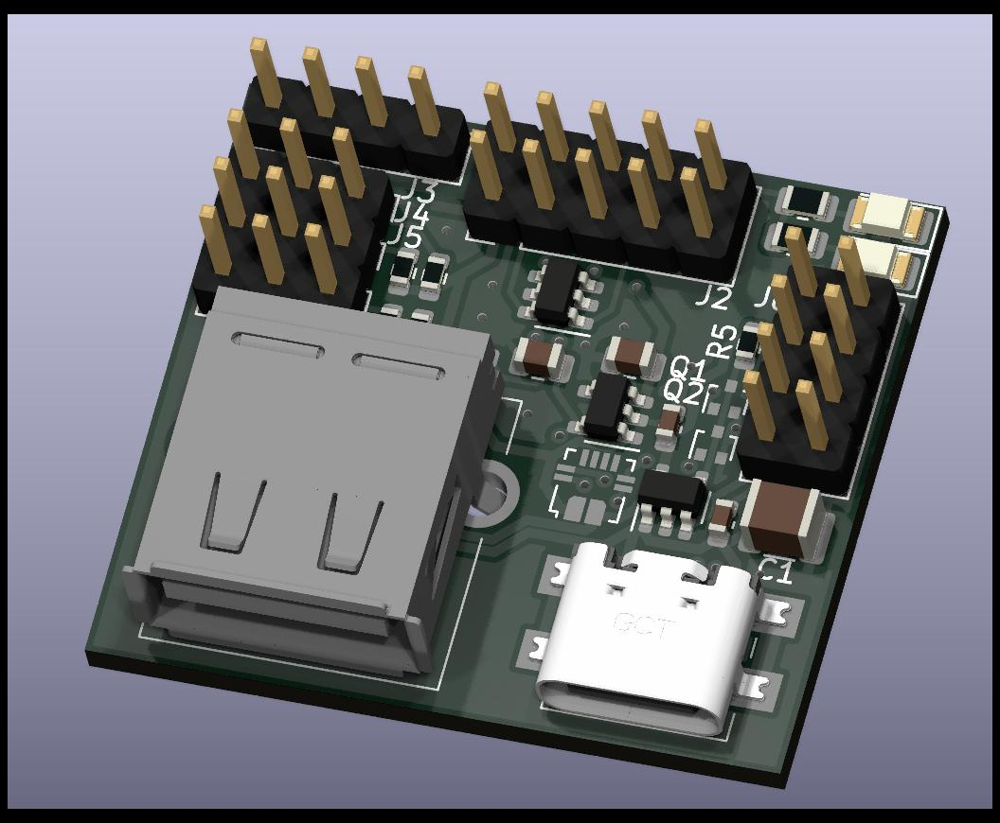
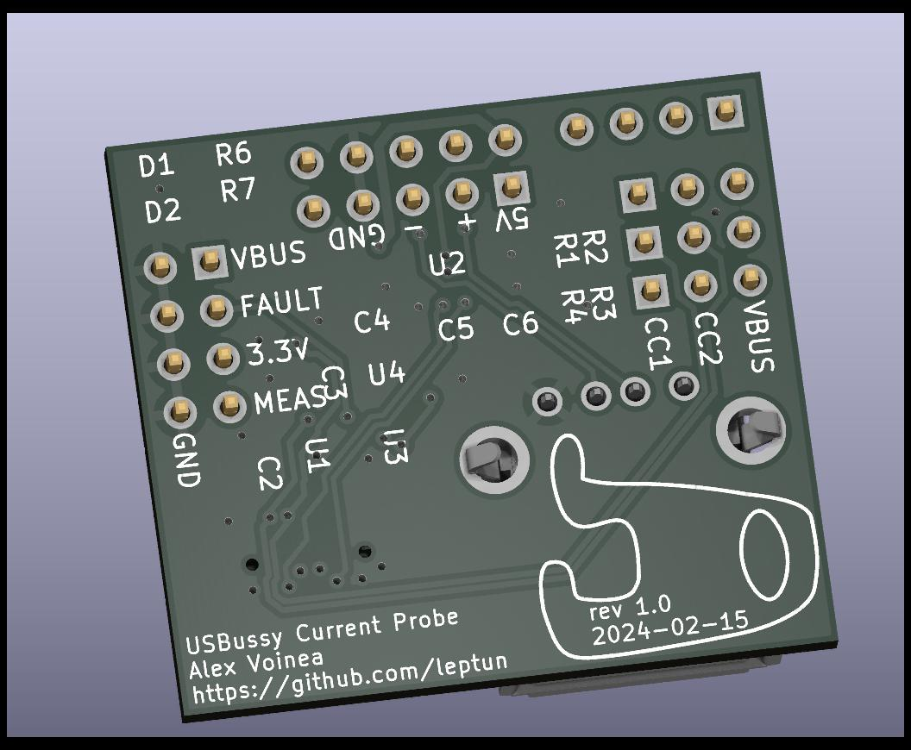

# USBussy_Current_Probe

This project is a simple USB current probe for my PC. It can function in two modes which are selctable via jumpers:
- As two ganged USB downstream facing ports (1x typeA, 1x typeC) that are connected to my PC's internal USB 2.0 headers.
- As a single typeA downstream facing port with a typeC upstream facing port.

